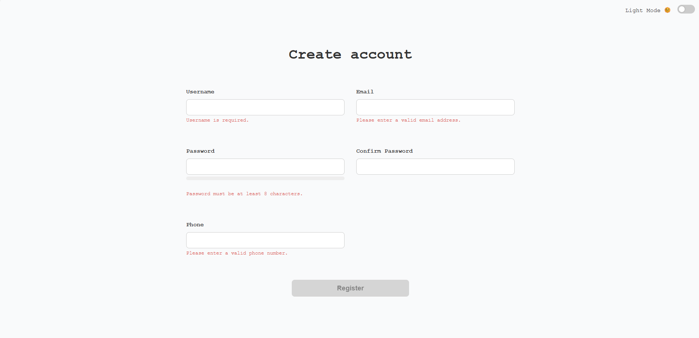
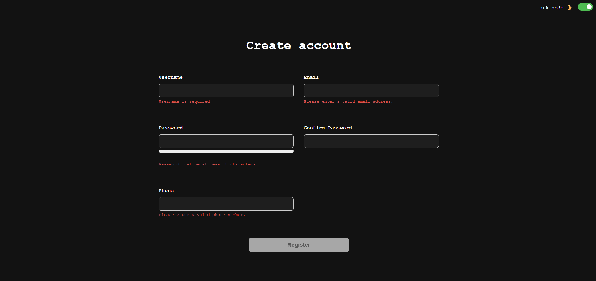
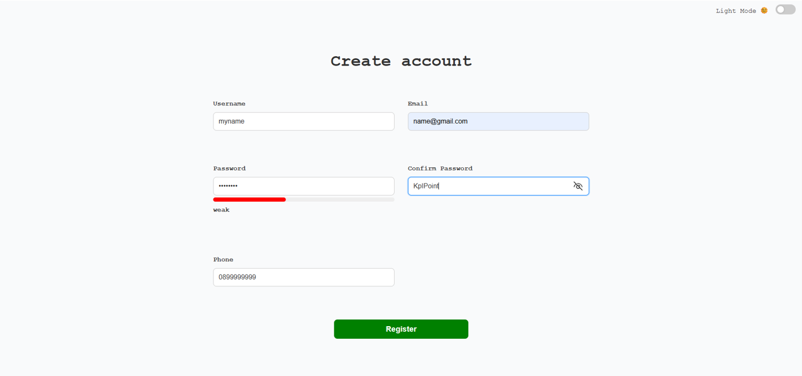
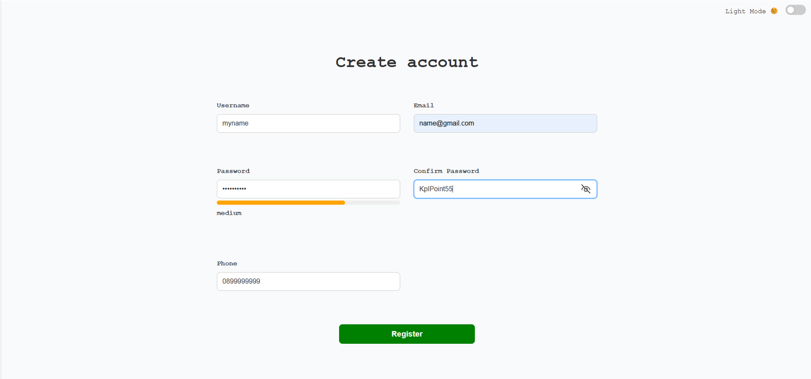
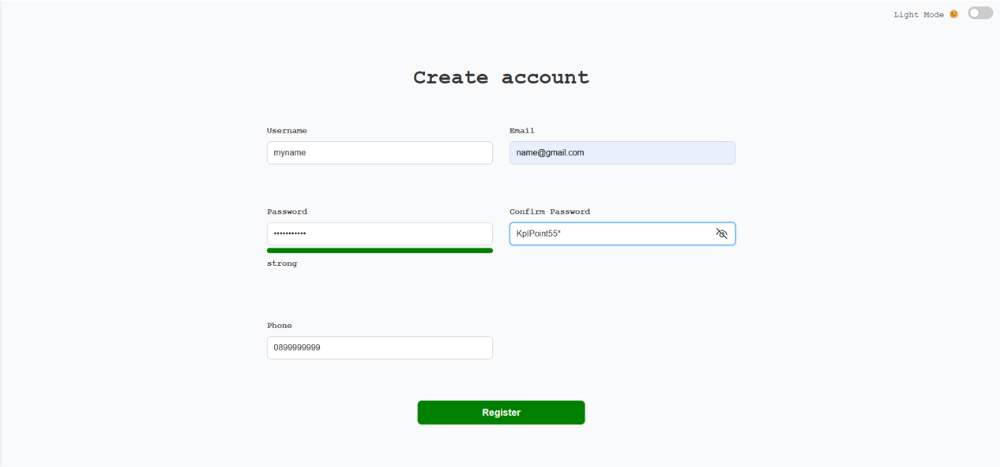
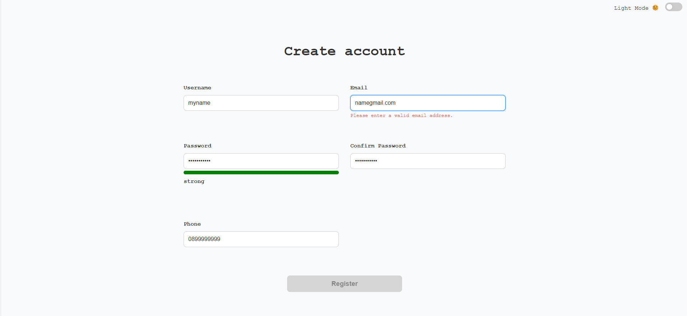
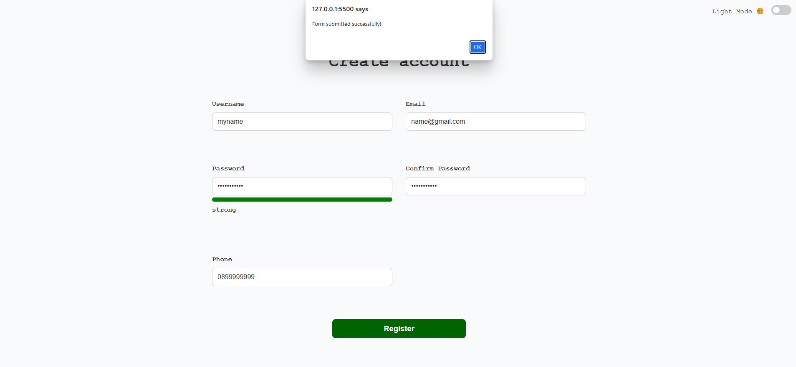

# Form Validation

A minimal front-end form validation project focused on
**accessibility**, **usability**, and **clean validation logic**.
Built with a mobile-first approach and no frameworks.

---

##   Features

- Accessible form validation (ARIA, keyboard-friendly)
- Mobile-first & responsive layout
- Client-side validation:
  - Username (required)
  - Email (regex validation)
  - Password (≥ 8 characters)
  - Confirm Password (must match Password)
  - Phone number (9–10 digits, e.g., Thai numbers)
- Password strength meter:
  - Checks length, uppercase, number, special character
  - Visual feedback: 🔴 Weak, 🟠 Medium, 🟢 Strong  
  - Accessible feedback announced via `aria-live="polite"`
- Dark / Light theme toggle using `data-theme` + `localStorage`
- Clean and reusable validation logic
- Built with HTML, CSS, and JavaScript

---

##📸 Screenshots
 
### 🟢 Light Mode


### 🌑 Dark Mode


### 🔐 Password Strength Meter




### ❌ Error Validation Example


### ✅ Success State


---

##   Design Decisions

### 1. Mobile-first approach
The layout was designed starting from small screens to ensure
usability on mobile devices before scaling up to larger screens.

### 2. Accessibility-first mindset
Accessibility was considered from the beginning of development:
- Semantic HTML elements (`form`, `label`, `input`)
- `aria-describedby` to associate inputs with error messages
- `aria-invalid` toggled dynamically for invalid inputs
- `role=”alert”` for error messages
- `aria-live="polite"` for password strength feedback
- Clear focus and error states for keyboard users

### 3. Error handling strategy
Each input field follows a predictable ID pattern:
- Input ID: `email`
- Error message ID: `email-error`
JavaScript dynamically maps inputs to their corresponding
error messages using template strings (`${input.id}-error`),
which helps avoid duplicated validation logic and improves maintainability.

### 4. Theme system
Theme switching is implemented using:
- CSS variables
- `data-theme` attribute on the root element
- `localStorage` to persist user preference

This approach allows easy scalability without rewriting styles.

---

##   What I Learned

- How to design form validation with accessibility in mind from the start
- How to structure HTML and JavaScript to reduce duplicated logic
- How to use predictable ID patterns to build reusable UI behavior
- How CSS variables and data attributes can simplify theming
- How to persist theme state using `localStorage`
- How `aria-live` can improve accessibility for dynamic feedback

---

##   Challenges & Solutions

- **Avoiding duplicated validation logic for multiple inputs**  
  → Solved by mapping input IDs directly to their error message elements.

- **Keeping the UI minimal while remaining accessible**  
  → Used ARIA attributes only where necessary to balance clarity and simplicity.

- **Persisting theme state across reloads**
→ Solved by saving and loading theme preference from `localStorage`.

---

##   Future Improvements

- Add real-time validation feedback on input blur
- Integrate backend validation and API handling
- Improve overall test coverage for validation logic
- Enhance password strength meter with more granular scoring

---

##   Tech Stack

- HTML5
- CSS3 (CSS Variables, Flexbox, Grid, Responsive Design)
- Vanilla JavaScript (Validation, Theme toggle, localStorage)

---

##   Live Demo

  https://github.com/Thanapong-Sk/my-frontend-projects/tree/1-form-validation

---

##   Installation

```bash
git clone https://github.com/Thanapong-Sk/my-frontend-projects.git 
cd 1-form-validation
Open index.html in your browser.

  Author
Thanapong Sukbua
Career-switcher Front-end Developer

---